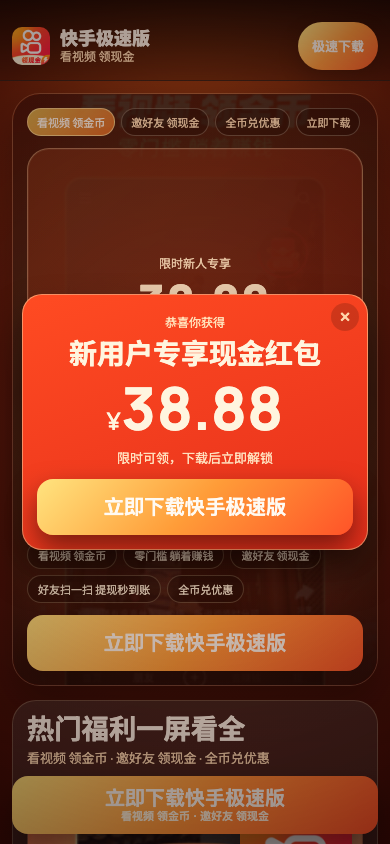
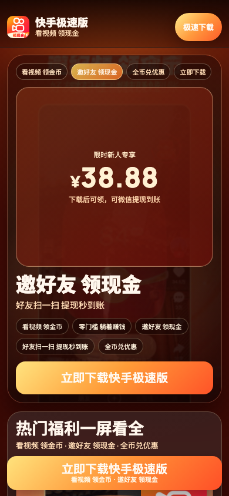
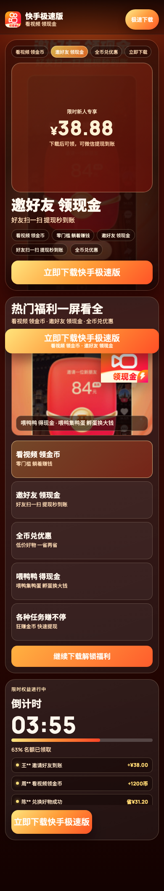
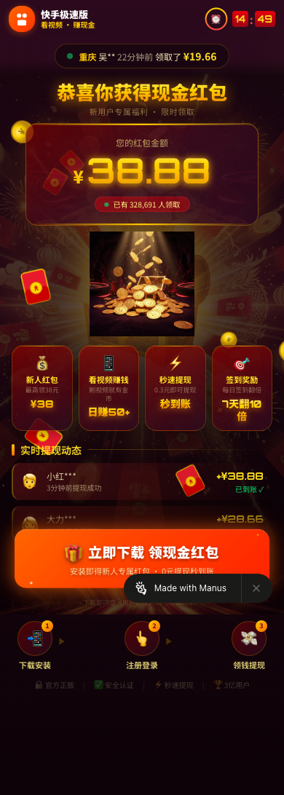

# 快手极速版 H5 对比评估（自研 v1 vs Manus，2026-03-03）

## 1. 评估对象
1. 自研页面（基于通用框架落地）：
- `compare/output/kuaishou-v1/index.html`
2. 对照页面（Manus）：
- `https://kuaishouldg-o9958yju.manus.space/`

## 2. 评估方法
1. 同一设备视口：`390x844`（iPhone 12 UA）
2. 同一截图策略：首屏截图 + 全页截图
3. 同一指标口径：首屏 CTA 数量、最小可点击高度、首个 CTA 垂直位置、页面高度
4. 自研页补充稳定性验收：`360/390/430` 三档布局与点击测试

## 3. 截图证据
### 3.1 自研页面（快手极速版 v1）
默认首屏（含首次激励弹层）：

关闭弹层后的首屏：

全页：

### 3.2 Manus 页面
首屏：

全页：

## 4. 客观指标对比（390x844）
来源：`compare/report/archive/kuaishou-v1/ks-vs-manus-metrics-v2.json`

| 指标 | 自研 v1 | Manus |
|---|---:|---:|
| 首屏可见 CTA 数 | 3 | 1 |
| 首屏最小 CTA 高度 | 48px | 81px |
| 首个 CTA 顶部位置 | 22px | 725px |
| 页面总高度 | 2103px | 1092px |

## 5. 自研页面稳定性验收（360/390/430）
来源：`compare/report/archive/kuaishou-v1/ks-v1-qa.json`

1. 三档机型均通过：
- 首屏无重叠（标题/组件与 CTA 不重叠）
- 悬浮 CTA 不越界
- CTA 触控高度均 `>=48px`
- CTA 跳转成功（到小米详情页，带参数透传）

2. 跳转样例：
- `https://app.xiaomi.com/details?id=com.kuaishou.nebula&src=qa&campaign=ksv1&lp_source=hero`

## 6. 差异分析与评价

### 6.1 品牌与利益点一致性
1. 自研 v1 更强：
- 直接基于小米“手机截图”提炼利益点并落地：
`看视频领金币 / 邀好友领现金 / 全币兑优惠 / 喂鸭鸭得现金 / 各种任务赚不停`。
- 使用小米详情页对应 logo 与截图素材，语义一致性更高。

2. Manus 略弱：
- 核心叙事更聚焦“现金红包”单一场景，品牌能力覆盖面较窄。
- 对“App 功能利益点矩阵”的呈现不如自研版本完整。

### 6.2 首屏转化压强
1. Manus 更强：
- 首屏视觉冲击更重（高亮金额 + 金币爆发 + 强对比色域）。
- 单一主按钮路径更直给，情绪推动非常集中。

2. 自研 v1 次之：
- 首屏虽有 3 个 CTA 触点，但主情绪峰值不如 Manus 集中。
- 弹层关闭后首屏冲击力下降明显，偏稳态而非爆发态。

### 6.3 可用性与工程稳态
1. 自研 v1 更强：
- 已完成多机型稳定性验证，布局和点击目标符合规范。
- 资源失败有兜底，参数透传与统一跳转函数完整。

2. Manus 风险点：
- 页面更依赖强动画与重视觉效果，弱机型/弱网下体验波动可能更大。
- 页面底部 `Made with Manus` 标识会影响商业投放页面的信任纯度。

### 6.4 信息结构与可扩展性
1. 自研 v1 更强：
- 3 屏结构清晰，适合后续进入“视频化/故事化/行业化”迭代。
- 配置驱动能力更完整，便于横向复制到其他 App。

2. Manus 更偏单页冲刺：
- 适合“短促强打”流量场景，但扩展成多行业模板成本更高。

## 7. 好坏理由总结

### 7.1 自研 v1
优点：
1. 利益点来源更可追溯，品牌语义更贴合快手极速版。
2. 移动端稳定性高，CTA 触达和可点击性可量化验收。
3. 模板化程度高，后续迭代和行业复用效率高。

不足：
1. 首屏爆发力弱于 Manus，情绪峰值不够“瞬时击穿”。
2. 首屏 CTA 触点较多，注意力有分散风险。
3. 页面偏长（2103px），相比 Manus 的短链路更考验持续动机。

### 7.2 Manus
优点：
1. 视觉冲击极强，首屏“红包收益”记忆点非常明确。
2. 情绪驱动和动效节奏强，短时间内吸睛能力更高。

不足：
1. 功能利益点覆盖不完整，偏重单一现金叙事。
2. 工程可维护性和通用扩展性弱于配置化方案。
3. 外显工具标识（Made with Manus）不利于正式投放质感。

## 8. 结论
1. 如果目标是“极短时间冲击点击”，Manus 版本更激进，首屏爆发力更强。
2. 如果目标是“稳定投放 + 品牌一致 + 可持续迭代”，自研 v1 更适合做主版本。
3. 推荐组合方案：
- 以自研 v1 作为投放基线（保证稳定与可配置）
- 吸收 Manus 的首屏冲击手法（金额光效、爆发转场、CTA 峰值）进入下一版（v2）
